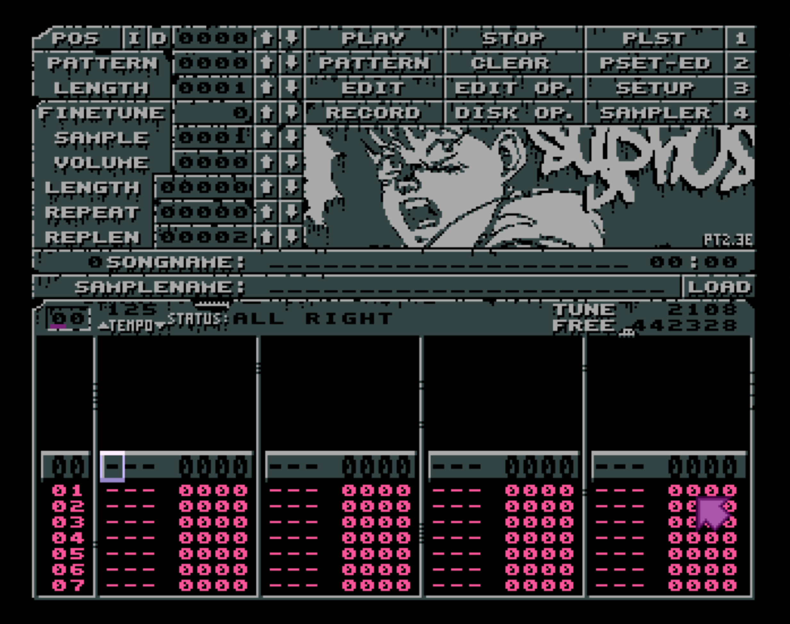

# bootPT
Bootable Amiga floppy disk image with Syphus' custom Protracker build

## Changelog

* v0.05 - new Protracker build based on 8bitbubsy's latest source (October 2019), and added mod2smp.cli
* v0.04 - new Protracker build based on 8bitbubsy's latest source (September 2019), and added some tiny intro code that displays an ASCII logo
* v0.03 - realised add36k was causing problems, replaced it with add44k
* v0.02 - fixed samples assign in PT-Config.00
* v0.01 - initial commit

## Usage

Boot the Amiga with this image - tested on A1200 and A500, and should work on almost all others. If you're dropped back to an AmigaDOS screen after getting a 'disk not found' message while swapping floppy disks/images ( to save/load modules or samples), don't worry - Protracker probably hasn't crashed, just lost focus. Hit Left-Amiga + M on the keyboard to switch back to Protracker. Enjoy!

## About

This is just a bootable ADF file which can be used with an emulator such as WinUAE (Windows) or FS-UAE (MacOS), or with a GOTEK USB floppy emulator on real Amiga hardware. It's intended for maximum compatibility with OCS/ECS machines (A500, A500+, A600), but should also work fine on AGA machines.

The startup-sequence first runs add44k, a tiny program that increases your available chipmem by removing one entire bitplane and shrinking the other to 50 pixels (written in 1992 by Alexander Rawass). Protracker can only address samples in chipmem since it uses the DMA to play back sampledata with almost no cost to the CPU. The disadvantage is that it's unable to access any fastram (RAM expansions, basically) you might have installed, limiting you to 512kb on a stock A500 or 2MB on a stock A1200, but lots of amazing tunes have been written within these limitations so don't get disheartened :D

After add44k has squeezed a bit more free memory out of the system for us, Protracker 2.3F runs automatically. This is my custom build of PT2.3F, which in turn is [8bitbubsy's](https://16-bits.org) fantastic overhaul of the previously definitive Protracker version: 2.3D. While 2.3D was the best, and more stable than most of its successors, it had a load of bugs that hung around for almost 20 years until 8bitbubsy redid the code from the ground up. Thanks to his tidying and helpful ASM comments, and thanks to some tips from StingRay^Scarab, I've been able to add some usability tweaks that I always wanted in Protracker plus - of course - my own custom graphics. Partly vanity, partly for fun, but also partly because I always used to be intrigued by demogroups' internal-only custom builds of popular demotools in the early 90s: typically they looked awesome but were actually kind of crappy and unstable, created (or modified to suit from available source) as OMG TOP SECRET GROUP-ONLY prods that eventually leaked out into the public domain.

Anyway, last night (19th October 2019) I decided to mess with the graphics assets in DeluxePaint IV to get a sort of decaying, decrepit feel for the GUI which seems appropriately Halloweeny for the time of year. It's based on 8bitbubsy's final source code for v2.3F and is probably as stable as Protracker is ever gonna get.

I've also added the CLI version of mod2smp by Tomasz Muszynski (Hali/Union) which allows you to 'bounce' down sections of a module to flat sampledata, which you can then load right back into Protracker. This is great for using multiple Protracker tracks to create some complex pad chord, sting or polyphonic drum pattern, then converting it all to a single mono sample that only uses one track in your module. Like everything, it's a tradeoff between filesize, flexibility and quality. Type mod2smp.cli without any arguments to see its built-in help, which gives you instructions and examples.

The only other thing to mention is that I added a folder of small chipsamples to the root of the disk, and set that folder as the default samples directory in Protracker's config. So it might be a fun way to get started with chiptracking on Amiga: just boot this image, maybe find some Protracker tutorials, and away you go!

Cheers,

Syphus / Up Rough
