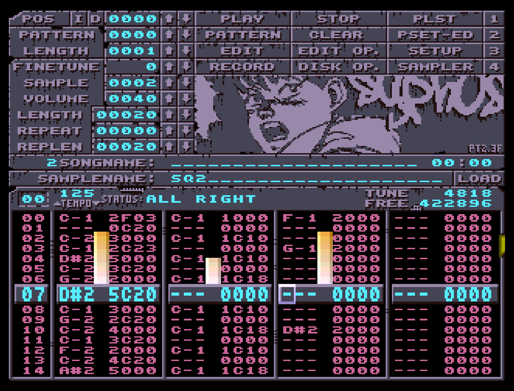

# bootPT
Bootable Amiga floppy disk image with Syphus' custom Protracker build

## Changelog

* v0.10 - fixed 128kb parallel port sampling in main branch and in bootPT custom build; updated bootPT image and LHA accordingly; updated PT version number in bootPT intro.
* v0.09 - reported an A500/A500+/A600-only bug in PT2.3F to 8bitbubsy, then updated the bootPT version with his fix; added an LHA containing the executable and config file for hard drive users
* v0.08 - tweaked some graphics and fixed the config
* v0.07 - merged 8bitbubsy's fixes to a raw sample loading bug I discovered
* v0.06 - new Protracker build based on 8bitbubsy's latest source (February 2020), and changed config references from DF0: to PTBOOT2.3F:, and finally updated About screen to reflect the 'F'
* v0.05 - new Protracker build based on 8bitbubsy's latest source (October 2019), and added mod2smp.cli
* v0.04 - new Protracker build based on 8bitbubsy's latest source (September 2019), and added some tiny intro code that displays an ASCII logo
* v0.03 - realised add36k was causing problems, replaced it with add44k
* v0.02 - fixed samples assign in PT-Config.00
* v0.01 - initial commit

## Usage

Boot the Amiga with this image - tested on A1200 and A500, and should work on almost all others. If you're dropped back to an AmigaDOS screen after getting a 'disk not found' message while swapping floppy disks/images ( to save/load modules or samples), don't worry - Protracker probably hasn't crashed, just lost focus. Hit Left-Amiga + M on the keyboard to switch back to Protracker. Enjoy!

If you want to use the bootPT version of ProTracker on a hard drive Workbench system rather than as a bootable image, you can find the executable and the default bootPT config file in [bootPT.lha](https://github.com/echolevel/bootPT/raw/master/bootPT.lha) (either on Amiga or on Mac/Windows/Linux with most unzip programs).

## Documentation (Protracker Manual/Helpfile)

See the About section (below) for some more info about this ADF and how to get it running, but for general Protracker documentation I've done a quick [Markdown reformat of the original PT2.3d helpfile](2019_PT_HELPFILE.md). It's built into Protracker, but it's sometimes difficult to navigate (and impossible to search through). I've added and annotated where appropriate, in reference to 2.3e and 2.3f changes, but it's an ongoing work in progress. Ultimately I'd like this to be a canonical repository of everything that's known about PT2.3d+ so please contribute if you think anything's missing!

## About bootPT

### Overview

This is just a bootable ADF file which can be used with an emulator such as WinUAE (Windows) or FS-UAE (MacOS), or with a GOTEK USB floppy emulator on real Amiga hardware. It can also be written to a real floppy disk just like any other disk image, if that floats your boat. It's intended for maximum compatibility with OCS/ECS machines (A500, A500+, A600), but should also work fine on AGA machines. It's also available as an LHA archive if your Amiga has a hard drive and you just want to run it from Workbench.

When you boot your Amiga with the bootPT image in the floppy drive, the startup-sequence runs add44k - a tiny program that increases your available RAM by removing one entire bitplane and shrinking the other to 50 pixels (written in 1992 by Alexander Rawass). See below for more info about how memory works on the Amiga.

After add44k has squeezed a bit more free memory out of the system for us Protracker 2.3F runs automatically.

A few notes about the default config I've included:

* AUTOEXIT is Off (so Disk Op stays open after you've loaded something, good if you're not sure which sample you want)
* MOD. ONLY is Off (so you'll see all files when loading modules, not just those with the mod.prefix. Protracker doesn't care whether a MOD has a 'mod' prefix/suffix: it'll attempt to load anything you tell it to)
* CUTTOBUFF is On (if you're on a stock A500, or have very limited chipmem for some other reason, you might want to disable this - it'll mean that any 'cut' operation while editing samples is destructive and final, but it might save you running out of memory)
* AUTODIR is Off (this should stop PT from reading directories until you've typed Return in the path field, reducing time-consuming lockups when reading floppy disks containing lots of files, but it doesn't seem to be working...maybe a bug?)
* The others you can look up in the 2019_PT_HELPFILE :)

### This version of Protracker

This is my custom build of PT2.3F, which in turn is [8bitbubsy's](https://16-bits.org) fantastic overhaul of the previously definitive Protracker version: 2.3D. While 2.3D was the best, and more stable than most of its successors, it had a load of bugs that hung around for almost 20 years until 8bitbubsy redid the code from the ground up. Thanks to his tidying and helpful ASM comments, and thanks to some tips from StingRay^Scarab, I've been able to add some usability tweaks that I always wanted in Protracker plus - of course - my own custom graphics. Partly vanity, partly for fun, but also partly because I always used to be intrigued by demogroups' internal-only custom builds of popular demotools in the early 90s: typically they looked awesome but were actually kind of crappy and unstable, created (or modified to suit from available source) as OMG TOP SECRET GROUP-ONLY prods that eventually leaked out into the public domain.

Anyway, last night (19th October 2019) I decided to mess with the graphics assets in DeluxePaint IV to get a sort of decaying, decrepit feel for the GUI which seems appropriately Halloweeny for the time of year. It's based on 8bitbubsy's final source code for v2.3F and is probably as stable as Protracker is ever gonna get.

I've also added the CLI version of mod2smp by Tomasz Muszynski (Hali/Union) which allows you to 'bounce' down sections of a module to flat sampledata, which you can then load right back into Protracker. This is great for using multiple Protracker tracks to create some complex pad chord, sting or polyphonic drum pattern, then converting it all to a single mono sample that only uses one track in your module. Like everything, it's a tradeoff between filesize, flexibility and quality. Type mod2smp.cli without any arguments to see its built-in help, which gives you instructions and examples.

The only other thing to mention is that I added a folder of small chipsamples to the root of the disk, and set that folder as the default samples directory in Protracker's config. So it might be a fun way to get started with chiptracking on Amiga: just boot this image, maybe find some Protracker tutorials, and away you go!

Cheers,

Syphus / Up Rough

## The Protracker user's guide to Amiga RAM types, limitations and expansions

Protracker works by using Paula (the Amiga custom chip that handles audio) to play 4 channels of sampled audio data. Paula can do this with almost no cost to the CPU by reading this sample data directly from chip memory and outputting the bytes through its DAC to your speakers or headphones. In order to achieve this, the sample data has to be in chip memory - the type of memory that comes built into all Amigas. Paula is unable to read or output any sample data directly from so-called 'fast' or 'slow' memory, which is the type of memory usually found in memory expansions. This limits you to e.g. 512kb RAM on a stock A500 or 2MB RAM on a stock A1200, but lots of amazing tunes have been written within these limitations so don't get disheartened :D Protracker will, however, try to put as much non-sample data (graphics, patterndata, etc) as possible in fast/slow mem in order to free up chip mem, so having some fast mem definitely helps.

Note: fast mem is memory which only the CPU can access, not the custom chips, so CPU access to data in fast mem is never slowed down by custom chips accessing chip mem. Slow mem is sort of the worst of both worlds: it's on the chip mem bus, but it's treated like fast mem in that only the CPU can access it but...because it's on the chip mem bus, it's blocked (ie slowed down) by the custom chips' memory operations. But hey, at least it's memory!

Back in the day, an A500 with a 512kb trapdoor memory expansion was understood to be a '1MB Amiga' because games which required 1MB of RAM would usually be quite happy with 512kb of slow mem in addition to the built-in 512kb of chip mem. Many Amiga owners had 512kb trapdoor RAM expansions and most gamers didn't understand (or need to understand) the difference between chip, fast and slow memory. Game programmers could use careful memory addressing techniques to ensure they were using chip mem for custom chip operations and then treat the slow mem much like fast mem, even if it was a bit slower. But that's no good for Protracker, where sampledata is king: the Paula chip can only kick out those 4 channels of lovely DMA audio if the sampledata is in Paula-accessible chip mem, so Protracker wants as much genuine CHIP mem as possible. But that doesn't mean fast/slow mem is redundant when using Protracker - it will still reserve as much chip mem as it can for sampledata and, where possible, use fast/slow mem for everything else (graphics, songdata, edit buffers etc).

Here's some info about how you could expand your desktop wedge-style Amiga (I'm less familiar with the big box models, but the general principles are the same):

| Amiga model | Stock Chip Mem | Chip Mem Limit | Fast/Slow Mem Options |
| ------------ | ------------- | ----------|------------ |
| A500 | 0.5MB (512KB) | 1MB with an ECS Agnus chip and motherboard mod | Extra 512kb 'slow' mem with trapdoor expansion; various accelerator and edge connector options, new and old |
| A500+ | 1MB | 2MB with trapdoor expansion | Various accelerator and edge connector options, new and old |
| A600 | 1MB | 2MB with trapdoor expansion | 4MB and 8MB fast mem expansions; more available with accelerators |
| A1200 | 2MB | 2MB is all you're getting! | Trapdoor ram expansions (some include FPU), various accelerators |

Much of the current market for new old stock and newly manufactured accelerators and ram expansions is based on people's desire to play old games using WHDLoad, a program that allows Amiga games to be installed to - and played directly from - hard disk. The overhead involved means that games which in the early 90s ran happily on a stock A1200, for example, now need a bit more RAM to run WHDLoad. A little bit of extra CPU helps too, but also people always want as much speed as possible :) If your main vibe is wanting to use Protracker on a real Amiga, however, you can have an absolute blast on just a stock A1200, A600 or A500+! Also a stock A500, but I'd say that a ~£20 512kb trapdoor RAM expansion (lots of newly manufactured ones are currently available) would be worth it to free up some of your chip mem by allowing Protracker to store graphics and song data in the extra 512kb of slow mem. Some of Protracker's VU meters might struggle slightly on an A500/A500+, and sample editing operations might take slightly longer, but the audio will never glitch - that's rock solid Paula/68k stuff and Paula doesn't care how fast your CPU is. So what I'm saying is: please don't go and blow loads of money on a load of fancy expansions until you're sure you need them!

Another tip for maximising chip memory on an Amiga is to turn off any unnecessary external floppy drives. I have two daisychained external drives (one real and one Gotek) and they each have an on/off switch at the back. If they're on and idle, the Amiga will allocate some memory to handling disk I/O on each drive and this can be between 5kb and 20kb. In my tests having both drives switched on can hog up to 38k, which is NOT ideal when every byte of chip mem is precious!
